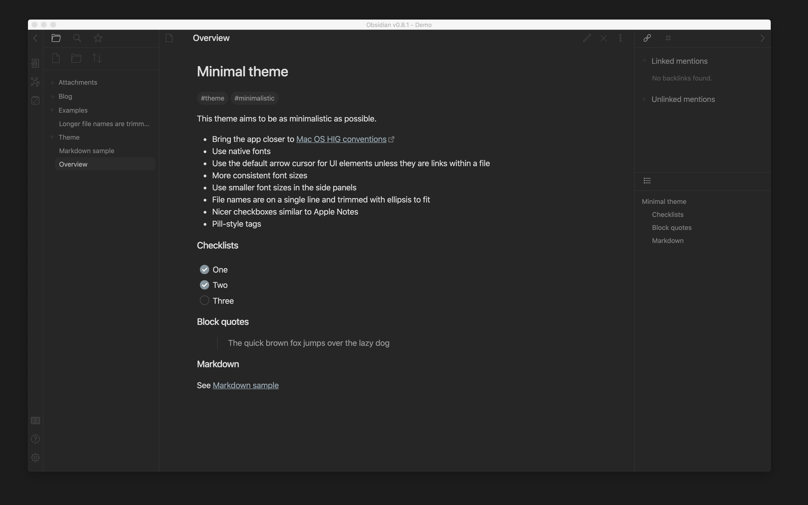
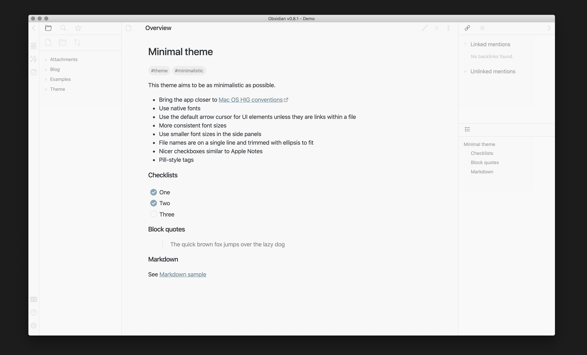

This theme aims to be as minimalistic as possible.

- Bring the app closer to [Mac OS HIG conventions](https://developer.apple.com/design/human-interface-guidelines/macos/overview/themes/)
- Use native fonts
- Use the default arrow cursor for UI elements unless they are links within a file
- More consistent font sizes
- Use smaller font sizes in the side panels
- File names are on a single line and trimmed with ellipsis to fit
- Nicer checkboxes similar to Apple Notes
- Pill-style tags

