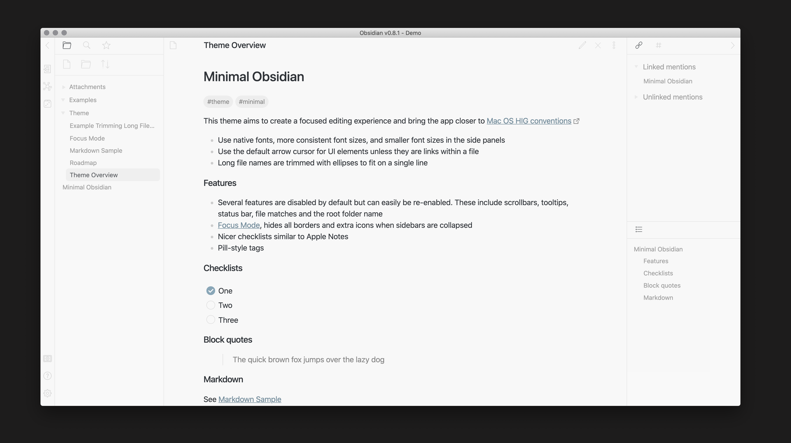
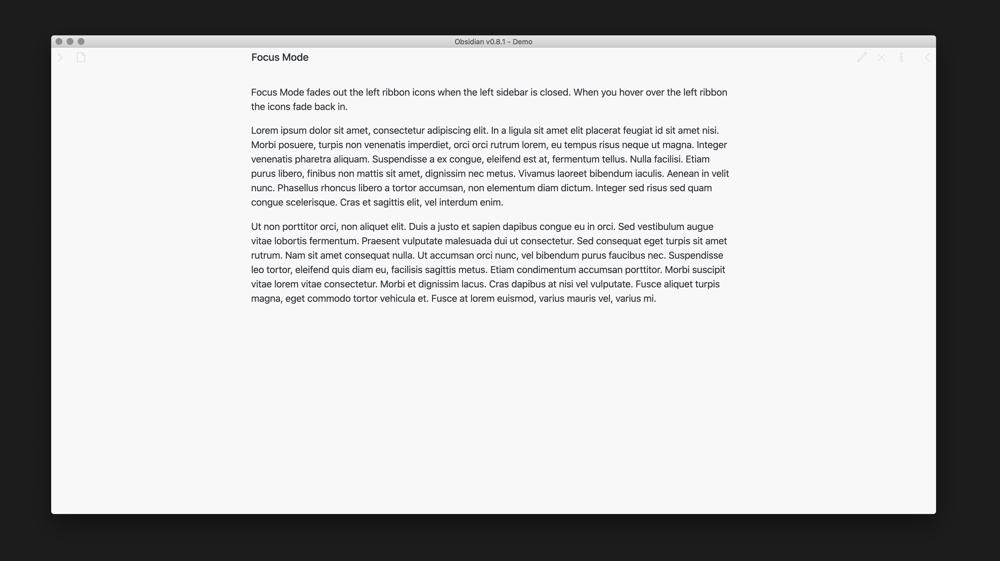
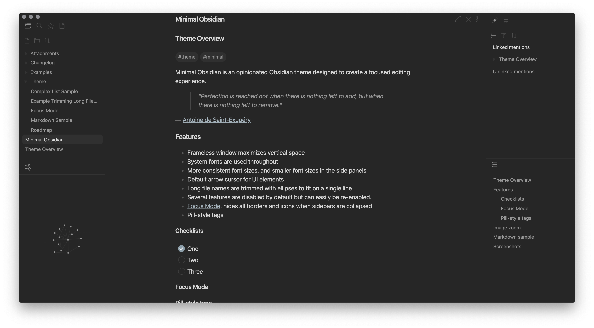

# Minimal

Minimal is an Obsidian theme meticulously designed to feel native on desktop, mobile and tablet. You can customize colors, fonts and more with the companion plugins [Minimal Theme Settings](https://github.com/kepano/obsidian-minimal-settings) and [Hider](https://github.com/kepano/obsidian-hider).

Support development: **@kepano** on [Twitter](https://www.twitter.com/kepano), [Patreon](https://www.patreon.com/kepano) or [Buy me a coffee](https://www.buymeacoffee.com/kepano).

✨ Winner of Obsidian's official [Best Theme award](https://forum.obsidian.md/t/best-of-2020-awards-results/11217)!

### Goals

- Simplify the Obsidian UI for a more focused editing experience
- Create a native look and feel on MacOS, iOS and iPadOS
- Make colors, fonts, and display features customizable

### Features

The following features can be toggled on/off using Minimal Theme Settings plugin:

- Background styles — multiple levels of contrast for light and dark mode, including True Black for OLED devices
- Focus mode — hides everything but the text sidebars are collapsed
- Fancy cursor — uses accent color for the cursor
- Hide sidebar borders
- Trim filenames
- Relationship lines
- Use system default cursor for UI elements

### Other enhancements

- When using [Hider](https://github.com/kepano/obsidian-hider) to turn off menu ribbon, it can be accessed by hovering over the bottom left edge of the window
- Click + hold to zoom in on images
- Use `#invert` to invert images in dark mode, e.g. `![[image.jpeg#invert]]`

### Plugin support

- [Sliding Panes](https://github.com/deathau/sliding-panes-obsidian) (aka Andy Mode)
- [Calendar Widget](https://github.com/liamcain/obsidian-calendar-plugin)
- [Kanban](https://github.com/mgmeyers/obsidian-kanban)
- [Checklist](https://github.com/delashum/obsidian-checklist-plugin)

### Gallery

### Disclaimer

This theme is provided as is, and is focused on my personal use of Obsidian on Mac OS. As such it is not thoroughly tested across all operating systems and features of Obsidian. 

This theme modifies significant parts of the Obsidian interface, so it might break with future updates. It may also be incompatible with other bits of custom CSS you have. The theme file is organized in such a way that you can comment out sections that may be causing conflicts.
