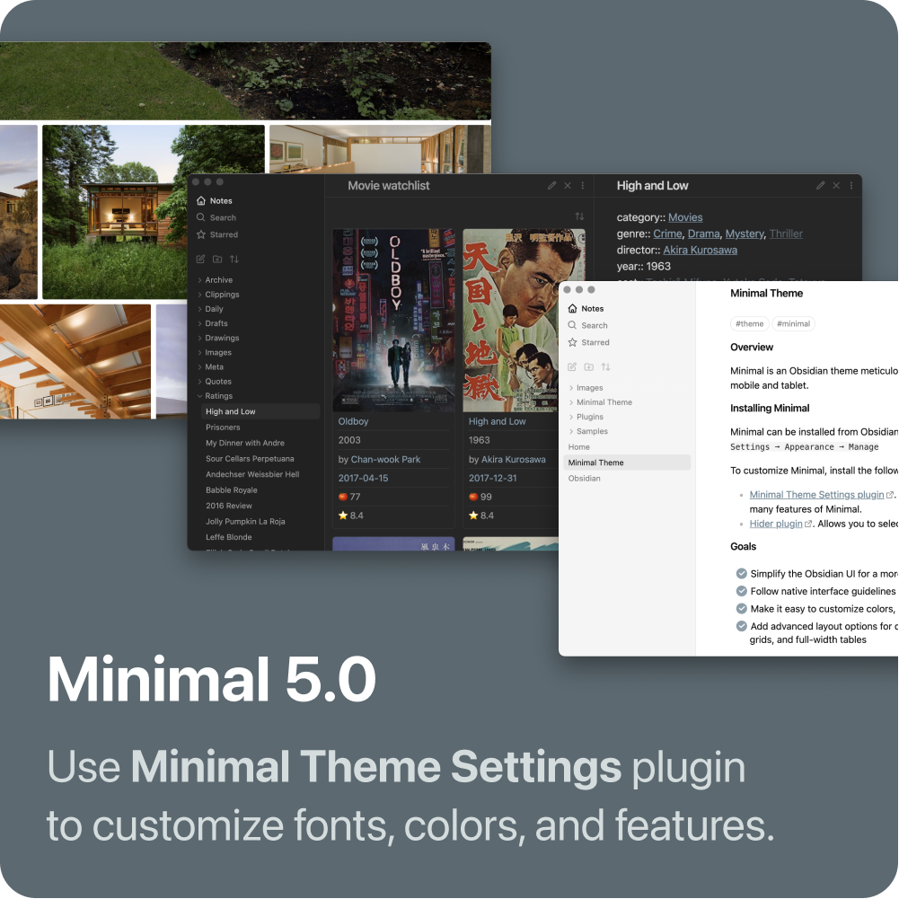

This theme aims to create a focused editing experience and bring the app closer to [Mac OS HIG conventions](https://developer.apple.com/design/human-interface-guidelines/macos/overview/themes/)

- Use native fonts, more consistent font sizes, and smaller font sizes in the side panels
- Use the default arrow cursor for UI elements unless they are links within a file
- Long file names are  trimmed with ellipses to fit on a single line

### Features
- Several features are disabled by default but can easily be re-enabled. These include scrollbars, tooltips, status bar, file matches and the root folder name
- Focus Mode, hides all borders and extra icons when sidebars are collapsed
- Nicer checklists similar to Apple Notes
- Pill-style tags

