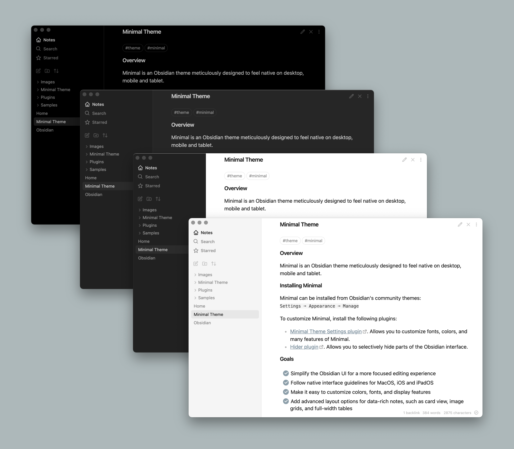
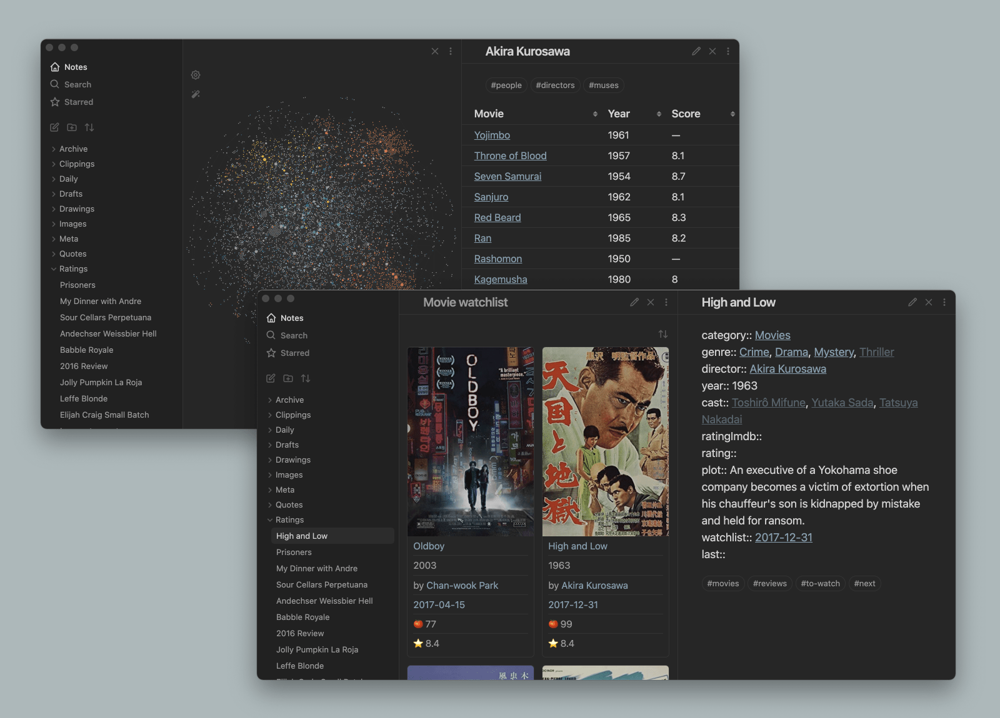
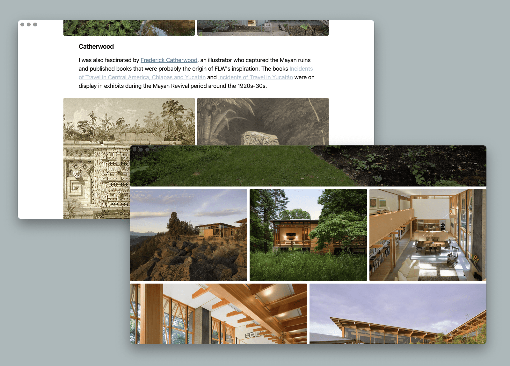
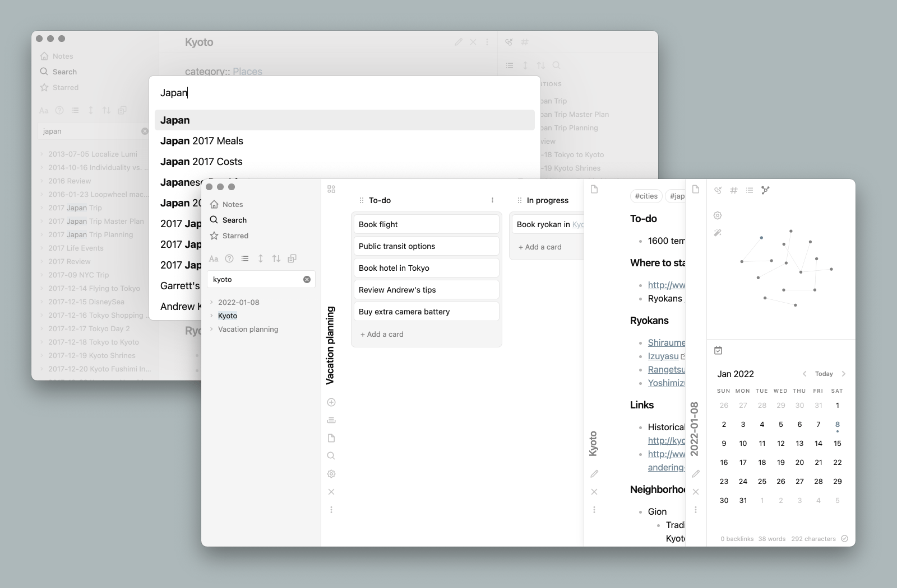
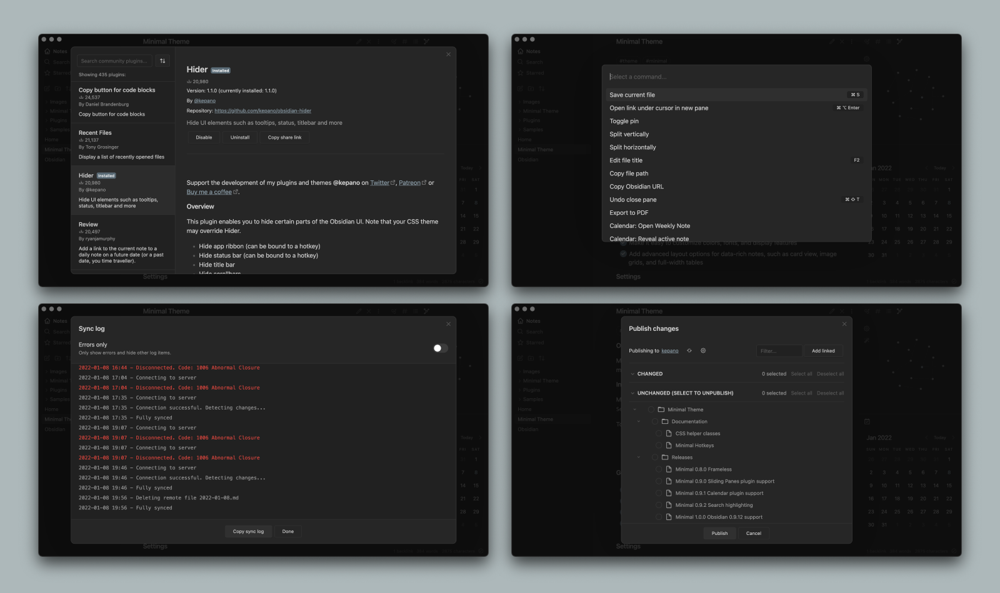

# Minimal

Winner of Obsidian's official [Best Theme award](https://forum.obsidian.md/t/best-of-2020-awards-results/11217) ✨ 


Minimal is an [Obsidian](https://obsidian.md/) interface replacement meticulously designed to feel native on desktop, mobile and tablet. You can customize colors, fonts and more with the companion plugins [Minimal Theme Settings](https://github.com/kepano/obsidian-minimal-settings) and [Hider](https://github.com/kepano/obsidian-hider).

Support development: **@kepano** on [Twitter](https://www.twitter.com/kepano) or [Buy me a coffee](https://www.buymeacoffee.com/kepano)

<a href="https://www.buymeacoffee.com/kepano"></a>

## About Minimal

- [Goals](#goals)
- [Screenshots](#screenshots)
- [Features](#features)
- [Installation](#installation)
- [Companion plugins](#companion-plugins)
- [Plugin support](#plugin-support)
- [Helper classes](#helper-filters-and-classes)
- [Hotkeys](#hotkeys)
- [Developers](#developers)
- [Disclaimer](#disclaimer)

## Goals

- Simplify the Obsidian UI for a more focused editing experience
- Follow native interface guidelines for MacOS, iOS and iPadOS
- Make it easy to customize colors, fonts, and display features
- Add advanced layout options for data-rich notes, such as card view, image grids, and full-width tables

## Screenshots

**Background styles** include low contrast, high contrast, and a true black option ideal for OLED devices



**Helper classes** for tables and card layouts allow you to create powerful workflows



Combining **focus mode** with **image grid** and **image width** options allows you to immerse yourself in visual projects



Minimal includes support for dozens of popular plugins like **Calendar**, **Kanban**, **Dataview**, **Outliner**, **Excalidraw**, **Sliding Panes**, [and more](#plugin-support)



Every screen in the Obsidian app has been revised to create a cohesive experience, including **settings**, **plugin browser**, **sync**, **publish**, and **file recovery**



## Features

The following features can be accessed using [Minimal Theme Settings](https://github.com/kepano/obsidian-minimal-settings) plugin or Style Settings plugin (see companion plugins instructions below)

- Background styles for light and dark mode, including true black ideal for OLED devices
- Focus mode — hides everything but the text when sidebars are collapsed
- Custom icons
- Fancy cursor — uses accent color for the cursor
- Hide sidebar borders
- Trim filenames
- Cursor options
- Click and hold to expand images

## Installation

- Open Obsidian Settings
- Go to `Appearance` and click `Manage`
- Under community themes search for Minimal and click `Use`

Have a question? Join the [Minimal channel](https://discord.com/channels/686053708261228577/931008597557649410) on the official [Obsidian Discord](https://discord.gg/veuWUTm).

## Companion plugins

To customize Minimal, install the [Minimal Theme Settings plugin](https://github.com/kepano/obsidian-minimal-settings) or [Style Settings plugin](https://github.com/mgmeyers/obsidian-style-settings). Minimal Theme Settings is best if you want to use [hotkeys](#hotkeys), while Style Settings has a few extra granular settings for headings and advanced features. Running both simultaneously is **not suggested** as this will lead to conflicts.

[Hider plugin](https://github.com/kepano/obsidian-hider) is recommended to hide Obsidian UI elements such as window frame, scrollbars, tooltips, etc. When using Hider to turn off the main toolbar (AKA app ribbon), it can be accessed by hovering over the bottom left edge of the window.

[Contextual Typography](https://github.com/mgmeyers/obsidian-contextual-typography) is required for advanced layout features such as image grids and block width options.

## Plugin support

Most plugins work well with Minimal, but the following plugins have received special love and attention:

- [Calendar](https://github.com/liamcain/obsidian-calendar-plugin)
- [Checklist](https://github.com/delashum/obsidian-checklist-plugin)
- [Contextual Typography](https://github.com/mgmeyers/obsidian-contextual-typography) — required for image grids and layout control
- [Dataview](https://github.com/blacksmithgu/obsidian-dataview)
- [Dictionary](https://github.com/phibr0/obsidian-dictionary)
- [Excalidraw](https://github.com/zsviczian/obsidian-excalidraw-plugin)
- [Git](https://github.com/denolehov/obsidian-git)
- [Hider](https://github.com/kepano/obsidian-hider)
- [Kanban](https://github.com/mgmeyers/obsidian-kanban)
- [Outliner](https://github.com/vslinko/obsidian-outliner)
- [QuickAdd](https://github.com/chhoumann/quickadd)
- [Sliding Panes](https://github.com/deathau/sliding-panes-obsidian) — recommended spine width 36px
- [Sortable](https://github.com/alexandru-dinu/obsidian-sortable) — recommended for cards and tables

## Helper filters and classes

Additional documentation can be found at [publish.obsdian.md/kepano](https://publish.obsidian.md/kepano)

## Image filters

Image filters can be added to create the following effects. Use them by adding the filter name at the end of the image link, e.g. `![[image.jpeg#invert]]`

| Filter     | Description                                                                        |
| :--------- | :--------------------------------------------------------------------------------- |
| `#invert`  | Invert images in dark mode — ideal for charts and handwriting on light backgrounds |
| `#invertW` | Invert images in light mode — ideal for charts and handwriting on dark backgrounds |
| `#circle`  | Crop image to a circle |

## CSS helper classes

CSS helper classes can be added on a per-file basis using the `cssClasses` [YAML front matter key](https://help.obsidian.md/Advanced+topics/YAML+front+matter). These classes are composable, so you can include more than one to combine effects.

For example, use the following code at the top of your file to enable cards layout: 
```
---
cssClasses: cards
---
```

### Image grids
Turns consecutive images into columns. To make a new row, add an extra line break between images. [Learn more.](https://github.com/kepano/obsidian-minimal/releases/tag/4.2.0)

| Class          | Description                                         |
| :------------- | :-------------------------------------------------- |
| `img-grid`     | Activate image grids |

### Line width control for tables, images and iframes
Controls the width of elements by type. [Learn more.](https://github.com/kepano/obsidian-minimal/releases/tag/4.2.0)

| Class                                   | Description                           |
| :-------------------------------------- | :------------------------------------ |
| `table-100`, `img-100`, `iframe-100`    | Fill 100% of the pane width           |
| `table-max`, `img-max`, `iframe-max`    | Fill the max line width (default 88%) |
| `table-wide`, `img-wide`, `iframe-wide` | Fill the wide line width              |

### Cards

Using `cards` transforms Dataview tables into cards that can be sorted using the [Sortable plugin](https://github.com/alexandru-dinu/obsidian-sortable). Compatible with table width classes.  Note that `cards` must be present for the other classes to work.

| Class                 | Description                                      |
| :-------------------- | :----------------------------------------------- |
| `cards` (required)    | Set all Dataview tables to card layout           |
| `cards-align-bottom`  | Align the last element of a card to the bottom   |
| `cards-cover`         | Images are resized to fill the defined space     |
| `cards-16-9`          | Fit images in cards to 16:9 ratio                |
| `cards-1-1`           | Fit images in cards to 1:1 ratio (square)        |
| `cards-2-1`           | Fit images in cards to 2:1 ratio                 |
| `cards-2-3`           | Fit images in cards to 2:3 ratio                 |
| `cards-cols-1` to `8` | Force a specific number of columns (from 1 to 8) |

### Tables and Dataview

Controls the row and column styling for tables. [Learn more.](https://github.com/kepano/obsidian-minimal/releases/tag/4.1.7)

| Class           | Description                                         |
| :-------------- | :-------------------------------------------------- |
| `table-nowrap`  | Disable line wrapping in table cells                |
| `table-numbers` | Add row numbers to tables                           |
| `table-tabular` | Use tabular figures in tables                       |
| `table-small`   | Use small font size in tables                       |
| `table-tiny`    | Use tiny font size in tables                        |
| `table-lines`   | Add borders around all table cells                  |
| `row-lines`     | Add borders between table rows                      |
| `col-lines`     | Add borders between table columns                   |
| `row-alt`       | Add striped background to alternating table rows    |
| `col-alt`       | Add striped background to alternating table columns |

### Embeds and transclusions

| Class          | Description                                         |
| :------------- | :-------------------------------------------------- |
| `embed-strict` | Transclusions appear seamlessly in the flow of text |


## Hotkeys

Hotkeys are only available when using the Minimal Theme Settings plugin.

### Background and borders

- Switch between light and dark mode
- Cycle between light mode styles
- Cycle between dark mode styles
- Toggle sidebar borders

### Layout control

- Toggle image grids
- Cycle between image width options
- Cycle between table width options
- Cycle between iframe width options

### Misc

- Toggle focus mode
- Increase and decrease body font size

## Developers

### Contributing

If you would like add support for a plugin, or have found a bug you'd like to help fix, don't hesitate to open a pull request. Have a question? Join the [Minimal channel](https://discord.com/channels/686053708261228577/931008597557649410) on the official [Obsidian Discord](https://discord.gg/veuWUTm).

### Build instructions

**Set up**

```
sudo gem install sass
npm install -g grunt-cli
npm install
```

**Define local path**

To build directly into your Obsidian vault rename `.env.example` to `.env` and update `OBSIDIAN_PATH` to the local path of your Obsidian theme folder.

**To run**

```
npx grunt
```

This builds two files, the `obsidian.css` distribution file (for the community themes store) which is minified and also copied to your vault for live reload, and the `Minimal.css` file which is an unminified copy saved to the project root.

### Distributing Minimal forks

Minimal is licensed under the MIT License which allows you to modify and redistribute the code, however you must preserve the copyright and license notice in your CSS file. This includes any code you may extract as standalone snippets.

**If you would like to distribute a fork of Minimal please keep my [Buy me a coffee](https://www.buymeacoffee.com/kepano) link present in your Readme.**

Minimal is frequently updated to stay current with the latest version of Obsidian. To make it easy to stay current with the latest improvements, I recommend using [Github's fork feature](https://docs.github.com/en/get-started/quickstart/fork-a-repo) so that you can merge the latest changes into your fork. If you have any questions don't hesitate to reach me in the Obsidian Discord group. 

## Disclaimer

This theme is provided as is, and is designed for my personal use of Obsidian on Mac OS. As such it is not thoroughly tested across all operating systems and use cases. 

This theme modifies significant parts of the Obsidian interface, so it may break with future updates. It may also be incompatible with other bits of custom CSS you have.
